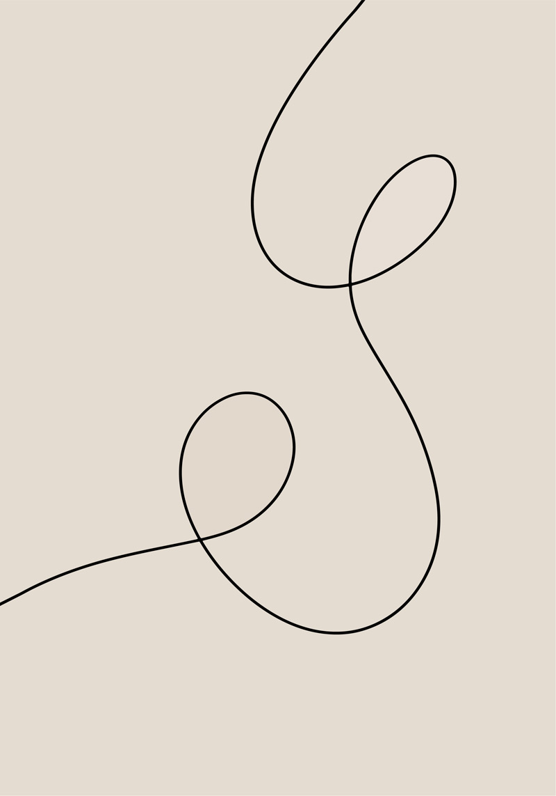

  

| Параметр | Данные студента |
| :--- | :--- |
| **ФИО** | Зокиров Бахтиер |
| **Университет** | Пермский Политех (Пермский Политех) |
| **Курс / Семестр** | 1 курс / 1 семестр |
| **Группа** | *(РИС-26-2б)* |
| **Направление** | *(Програмная инженерия, РИС)* |

---

* **Язык программирования:** C++
* **Система контроля версий:** Git & GitHub
* **Среда разработки:** Visual Studio Code
